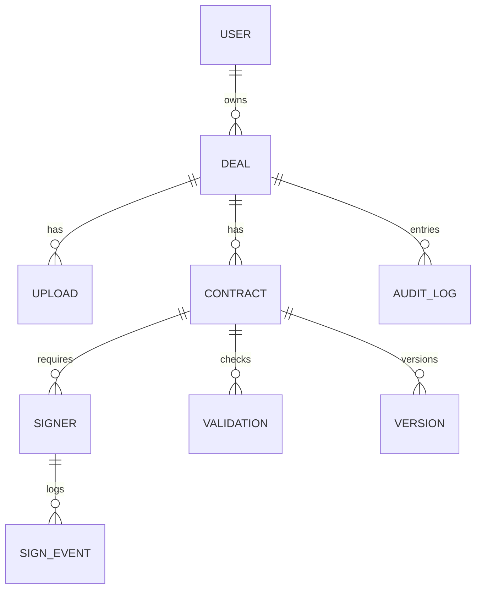

# Multi‑Agent Real‑Estate Contract Platform — Software Specification

> Version: 0.9 (Draft)  
> Date: 2025‑08‑02  
> Owner: Chris (Product/Eng)  
> Scope: End‑to‑end system for ingesting real‑estate documents, generating contracts, compliance/error checks, multi‑party signature tracking, and contextual help via an AI agent.  
> Environments: Dev (SQLite), Staging (Postgres), Prod (Postgres, S3-compatible storage)

---

## 1. Project Overview

### 1.1 Goals
- Automate **document ingestion** (PDF, DOCX, images via OCR).
- Generate **standardized contracts** from data & templates.
- Perform **error/compliance checks** before signatures.
- Track **multi‑party signatures** with robust audit trails.
- Provide a **contextual Help Agent** that can explain the contract, status, and next steps.

### 1.2 Intended Users
- Agents/Brokers, Transaction Coordinators, Compliance/Admins, Buyers/Sellers, Lenders, Title/Notary.

### 1.3 Functional Requirements (high‑level)
- Upload → Parse → Extract entities → Generate draft contract → Review/Redline → Validate → Sign → Archive/Export.
- Template library with variables/conditions.
- Multi‑party routing (email/SMS links), reminders, status dashboard.
- Audit log of **who/what/when/how**, immutable.
- Role‑based access; JWT auth.
- Model selection & thresholds via Admin.
- Export contracts (PDF/Docx), data reports (CSV/JSON).

### 1.4 Non‑Functional Requirements
- Availability: 99.9% (prod).
- Security: JWT + TLS, hashed secrets, signed URLs, PII minimization, audit trails.
- Observability: structured logs, traces, metrics; request IDs.
- Performance targets: typical doc ingest < 10s (native PDF); OCR jobs async.
- Compliance posture: ESIGN/UETA baseline; EU eIDAS optional; retainable, queryable audit trail.
- Extensibility: plug‑in agents, new templates, new parsers.

---

## 2. System Architecture

### 2.1 High‑Level Diagram (Mermaid)
```mermaid
flowchart LR
  subgraph FE[Next.js Frontend]
    UI[UI: Dashboard, Intake, Generator, Review, Sign Tracker, Admin]
    Help[Help Agent Modal]
  end

  subgraph BE[FastAPI Backend]
    API[(REST API)]
    Auth[Auth/JWT]
    Parsers[Parsers: PDF/DOCX/OCR]
    Tmpl[Template Engine]
    Val[Compliance/Error Checker]
    Sig[Signature Service + Webhooks]
    Files[S3 Storage]
    DB[(Postgres/SQLite)]
    Celery[Celery Workers + Redis]
  end

  subgraph AI[Multi-Agent System]
    Mgr[Orchestrator (CrewAI/LangGraph)]
    Extract[Data Extraction Agent]
    Gen[Contract Generator Agent]
    Check[Error/Compliance Agent]
    Track[Signature Tracker Agent]
    Sum[Summary Agent]
    HelpA[Help Agent]
    Router[Model Router (OpenRouter / Local Ollama)]
  end

  UI <--> API
  Help <--> API
  API <--> Auth
  API <--> Parsers
  API <--> Tmpl
  API <--> Val
  API <--> Sig
  API <--> DB
  API <--> Files
  API --> Celery
  API <--> Mgr
  Mgr <--> Extract & Gen & Check & Track & Sum & HelpA
  Mgr <--> Router
```

### 2.2 Communication
- **Frontend ↔ Backend**: HTTPS REST (JSON). SSE/Websocket optional for live job status.
- **Backend ↔ AI Orchestrator**: local process call (Python) or HTTP loopback.
- **Storage**: S3‑compatible for uploads; signed URLs for FE.
- **Background**: Celery + Redis for OCR, heavy parsing, long LLM jobs.
- **Webhooks**: from e‑signature provider into FastAPI.

### 2.3 Environments
- **Dev**: Docker compose (FastAPI, Next.js, Redis, MinIO, SQLite).
- **Staging/Prod**: Postgres, Redis, S3/MinIO, HTTPS, OIDC provider optional.

---

## 3. Frontend Specification (Next.js + Tailwind + shadcn/ui + Zustand + Framer Motion)

### 3.1 Common
- **State**: auth/token, current deal, uploads, extraction results, draft, signature status.
- **Theming**: dark by default; responsive; keyboard shortcuts.
- **Data Fetch**: React Query or custom SWR wrapper; optimistic UI for metadata edits.

### 3.2 Pages & Components

#### 3.2.1 Dashboard
- **Widgets**: “My Deals”, “Pending Signatures”, “Compliance Alerts”, “Recent Uploads”.
- **Components**: `<Card>`, `<Table>`, `<Badge>`, charts (Recharts).
- **Logic**: fetch stats; filter by user/role/date.
- **Responsive**: cards stack on <md.

#### 3.2.2 Document Intake
- **Flow**: drag‑drop → pre‑parse preview → choose type/template → submit.
- **Components**: file dropzone, progress, extraction summary list, error toasts.
- **Edge cases**: multi‑file bundles; scanned vs native; password‑protected PDFs.

#### 3.2.3 Contract Generator
- **Panels**: left (template + variables), center (live draft), right (hints/errors).
- **Features**: variable form, clause toggles, conditional blocks, regenerate with agent notes.
- **Actions**: save draft, version diff, send to Review.

#### 3.2.4 Review
- **Features**: redline view (before/after), comment threads, change requests.
- **Components**: diff viewer, timeline, approve/reject buttons.
- **Shortcuts**: approve (A), request changes (R).

#### 3.2.5 Signature Tracker
- **List**: parties, roles, status, reminders due, RON flag.
- **Detail**: audit trail; re‑send; cancel; download signed PDF + cert.
- **Webhooks**: live updates to status pill.

#### 3.2.6 Help Agent Modal
- **Invoke**: `?` or floating button.
- **Context**: active document, audit trail slice, unresolved checks, current user role.
- **UI**: chat + “What’s left?”, “Explain clause”, “Summarize changes”, “Generate checklist”.

#### 3.2.7 Admin Panel
- **Sections**: Users/Roles, Templates, Model Routing, Thresholds, Integrations, Audit search.
- **Controls**: model dropdown (OpenRouter IDs), fallback list, max tokens, temperature, risk thresholds.

##### Example (shadcn/ui + Zustand)
```tsx
// useDealStore.ts
import { create } from "zustand";
type DealState = { dealId?: string; setDealId:(id?:string)=>void };
export const useDealStore = create<DealState>((set)=> ({
  dealId: undefined, setDealId:(id)=>set({dealId:id})
}));
```

```tsx
// HelpAgentModal.tsx (sketch)
import { Dialog, DialogContent, DialogTrigger } from "@/components/ui/dialog";
export default function HelpAgentModal(){ /* fetch /help/context?dealId=... */ return (
  <Dialog>
    <DialogTrigger className="fixed bottom-6 right-6 rounded-full p-3 shadow-lg">?</DialogTrigger>
    <DialogContent className="max-w-2xl h-[70vh]">
      {/* chat messages + quick actions */}
    </DialogContent>
  </Dialog>
);}
```

---

## 4. Backend Specification (FastAPI + SQLModel)

### 4.1 Tech
- **FastAPI** (typed, OpenAPI), **SQLModel** (sync/async), **Alembic** migrations.
- **Auth**: OAuth2 password or OIDC; **JWT** access/refresh; roles/claims.
- **Storage**: S3/MinIO for files; pre‑signed URLs.
- **Tasks**: Celery + Redis for OCR/LLM; FastAPI BackgroundTasks for lightweight jobs.

### 4.2 REST Endpoints (concise)
| Method | Path | Purpose |
|---|---|---|
| POST | `/auth/login` | issue JWT |
| POST | `/auth/refresh` | refresh JWT |
| GET | `/me` | current user |
| POST | `/files` | init upload |
| POST | `/files/{id}/complete` | finalize upload |
| GET | `/files/{id}` | file meta |
| POST | `/ingest/{file_id}` | parse/extract (async) |
| GET | `/jobs/{id}` | job status/result |
| POST | `/contracts` | create draft (template_id, vars) |
| GET | `/contracts/{id}` | get draft |
| PATCH | `/contracts/{id}` | update vars/clauses |
| POST | `/contracts/{id}/validate` | run checks |
| POST | `/contracts/{id}/send` | send for signature |
| GET | `/contracts/{id}/audit` | audit trail |
| GET | `/signatures/{id}` | signer status |
| POST | `/signatures/{id}/remind` | reminder |
| POST | `/webhooks/sign` | provider webhook |
| GET | `/admin/models` | list models |
| PATCH | `/admin/models` | set routing/thresholds |
| CRUD | `/admin/templates` | manage templates |
| CRUD | `/admin/users` | manage users |

### 4.3 Snippets

**Models**
```py
from sqlmodel import SQLModel, Field, Relationship
from datetime import datetime
from typing import Optional

class User(SQLModel, table=True):
    id: int | None = Field(default=None, primary_key=True)
    email: str = Field(index=True, unique=True)
    role: str  # admin, agent, tc, signer

class Upload(SQLModel, table=True):
    id: int | None = Field(default=None, primary_key=True)
    owner_id: int = Field(foreign_key="user.id")
    filename: str; content_type: str; s3_key: str
    pages: int | None = None; ocr: bool = False
    created_at: datetime = Field(default_factory=datetime.utcnow)

class Contract(SQLModel, table=True):
    id: int | None = Field(default=None, primary_key=True)
    deal_id: str; template_id: str
    status: str  # draft, review, sent, signed, void
    variables: dict | None = None
```

**JWT Auth**
```py
from fastapi import Depends, HTTPException
from fastapi.security import OAuth2PasswordBearer
import jwt, time

oauth2 = OAuth2PasswordBearer(tokenUrl="/auth/login")
SECRET="change_me"

def current_user(token=Depends(oauth2)):
    try:
        payload = jwt.decode(token, SECRET, algorithms=["HS256"])
        if payload["exp"] < time.time(): raise Exception("expired")
        return payload
    except Exception:
        raise HTTPException(status_code=401, detail="Invalid token")
```

**Async task trigger**
```py
# POST /ingest/{file_id}
task_id = celery_app.send_task("ingest.parse", args=[file_id]).id
return {"job_id": task_id}
```

**Parsers**
- Native PDF: PyMuPDF/pdfminer for text; pdfplumber/Camelot for tables.
- Scans: pdf2image → Tesseract OCR; deskew/denoise; layout heuristics.
- DOCX: python-docx; styles map → template fields.
- Collections: ZIP for multi‑file; maintain order & provenance metadata.

### 4.4 Background Processing
- Celery queues: `ingest`, `ocr`, `llm`, `export`.
- Retries with backoff; idempotent tasks; persist task results.
- Flower (optional) for ops visibility.

---

## 5. AI Agent System

### 5.1 Orchestration
- **CrewAI** (or **LangGraph**) to coordinate specialists:
  - Role‑Goal‑Backstory pattern for agent definitions.
  - Tools: file loader, vector search, template engine, validator, e‑sign API, DB.

### 5.2 Agents
- **Data Extraction**: parse/normalize entities; confidence scores.
- **Contract Generator**: fill templates; propose clauses; structured JSON + Docx.
- **Error Checker**: run rules (required fields, signatures, dates, amounts, jurisdiction‑specific); policy packs.
- **Signature Tracker**: monitor provider status; reconcile webhooks; reminders.
- **Summary Agent**: produce short/long summaries, diffs, checklists.
- **Help Agent**: contextual Q&A; status; “what’s left”; clause explainers.

### 5.3 Model Routing
- **OpenRouter** first‑class: admin chooses model; optional *auto router* with fallbacks.
- **Local/Remote containers**: Ollama endpoint support; health & latency checks.
- **Policy**: sensitive docs → private/provider allowlist; token caps; cost guardrails.

### 5.4 Prompt/Tooling Strategy
- System prompts per role; structured outputs (Pydantic schema).
- Tool calls for retrieval, validation, signing actions.
- Memory: per‑deal scratchpad (vector + relational provenance).

---

## 6. Help Agent

### 6.1 Modal UX
- Floating button (fixed bottom‑right).
- Threads per deal; searchable.
- Quick actions: Explain clause, Show blockers, Generate checklist, Summarize audit.

### 6.2 Context Assembly
- Inputs: contract draft, extracted data, unresolved validations, signature states, user role, recent comments.
- Output modes: concise bullets; expandable detail; link to source (line/page).

### 6.3 Prompting
- Role = Transaction Guide; Goals = accurate, auditable, neutral; Backstory = real‑estate workflow expert.
- Guardrails: show provenance; avoid legal advice disclaimers; escalate to human when low confidence.

---

## 7. Database Schema

### 7.1 ER (Mermaid)


### 7.2 Tables (concise fields)
- **users**: id, email, name, role, created_at, disabled
- **deals**: id, title, status, owner_id, created_at
- **uploads**: id, deal_id, filename, s3_key, content_type, pages, ocr, created_at
- **contracts**: id, deal_id, template_id, status, variables(jsonb), created_at
- **versions**: id, contract_id, number, diff, created_at
- **signers**: id, contract_id, party_role, name, email, phone, order, status
- **sign_events**: id, signer_id, type, ip, ua, ts, meta
- **validations**: id, contract_id, rule_id, severity, ok, detail, created_at
- **templates**: id, name, version, docx_key, schema, ruleset
- **audit_logs**: id, deal_id, actor, action, ts, meta

---

## 8. Admin Features

- **User mgmt**: invite, roles, lock/disable, API keys.
- **Template mgmt**: upload DOCX/PDF template, map schema, test fill, version.
- **LLM model selection**: provider+model, fallbacks, temp/top_p, max tokens; cost guardrails.
- **Threshold tuning**: extraction min confidence, validation severity gates.
- **Integrations**: e‑sign provider config, SMTP, SMS, storage.
- **Audit search**: filter by actor, time, deal, action.

---

## 9. Example Workflows

### 9.1 Upload → Extract → Generate → Review → Sign → Export
1) User uploads files → `/files` → pre‑parse preview.  
2) Backend enqueues `ingest.parse` → extraction JSON stored; confidence scores.  
3) Generator agent fills template → draft V1.  
4) Reviewer runs validations → address errors → approve.  
5) Send for signature → parties notified → webhook updates status.  
6) All signed → final PDF + cert archived → export bundle (PDF + JSON + audit).

### 9.2 Help Agent flow
- User asks “What’s left?” → backend composes context (open validations, unsigned parties, missing docs) → agent replies with checklist + links.

### 9.3 Error & Compliance
- Rule packs: **Required fields**, **Date ranges**, **Initials on pages**, **Clause presence by state**, **Numerical consistency**, **Signer roles**.  
- Severity gates: `blocker` (must fix), `warn` (allow override with reason).

---

## 10. Security & Compliance Notes
- ESIGN/UETA baseline; audit trail with timestamps, IP, auth method, document hash; tamper‑evident final PDFs.
- PII minimization; encryption at rest (S3, DB) + in transit (TLS).  
- Log redaction; rotate keys; least privilege IAM; signed URLs short‑lived.  
- Backups + disaster recovery RPO/RTO targets.

---

## 11. DevOps
- Docker compose (dev); IaC (Terraform) for staging/prod.  
- CI: lint, type‑check, tests (pytest), e2e (Playwright), API contract tests.  
- CD: migrations, blue/green or canary; feature flags.  
- Observability: OpenTelemetry traces; metrics dashboards; alerting.

---

## 12. Open Questions / Next Steps
- E‑sign provider choice (DocuSign/Dropbox Sign/Signwell/etc.).  
- RON support scope.  
- Jurisdictional rule packs (state templates).  
- Redaction/PII discovery pipeline.  
- Role mapping: brokerages vs individual agents.

---

### Appendix A — Minimal FastAPI Route
```py
from fastapi import FastAPI, UploadFile, File
app = FastAPI()

@app.post("/files")
async def upload(file: UploadFile = File(...)):
    # issue presigned URL or stream to S3
    return {"id":"upl_123","filename":file.filename}
```

### Appendix B — Example Validation Rule (Pydantic)
```py
from pydantic import BaseModel, Field, ValidationError
class Purchase(BaseModel):
    price: float = Field(gt=0)
    close_date: str
```

---

**End of Spec**
